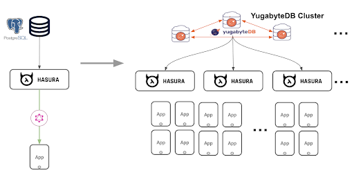
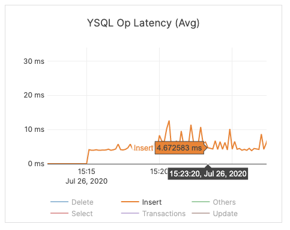
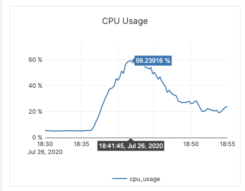
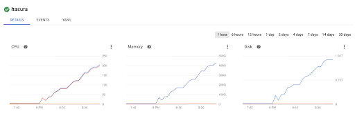

# Scaling GraphQL subscritpion to 1 Million subscrptions using Hasura GraphQL Engine and YugabyteDB deployed on Kubernetes

Results obtained by running the benchmarks on a kubernetes cluster where GraphQL subscriptions are scaled from 25K subscriptions to 1 Million subscriptions linearly without any downtime. 

## Scaling linearly to 1M subscriptions

No. of Subscriptions | YugabyteDB: Number of vCPUs | Hasura: Number of vCPUs 
| -----------------------| ------------------------------------- | ------------------------------
25K | 8 | 4
50K | 16 | 12
100k | 32 | 20
1M | 320 | 200

## Details of the benchmark resources

No. of Subscriptions | YugabyteDB Cluster | Hasura Pods | GraphQL Subscription Tool
| -----------------------| ------------------------| ----------------|--------------------------------
25K  | 4 pods, 2 vcpus (4GB RAM, 2x50GB SSD) | 1 Pod * 4 vCPUs, 8GB RAM  | 25k subscribers, 4vcpu, 8GB RAM
50K  | 4 Tservers - 4 vCPUs/8 GB, 2 * 50 GB SSD | 3*pod * 4xCPU, 8GB RAM | 50k subscribers, 4vcpu, 8GB RAM
100k | 4 Tservers -  8 vCPU, 16 GB, 2 * 50 GB SSD | 5 pod * 4vcpu/ 8GB RAM | 100K subscribers 4vcpu, 8GB RAM
1M | 20 pods of 16 vCPUs each | 50 Pod * 4 Vcpu, 8 GB RAM | 1M subscribers 8vcpu, 16GB RAM

## Metrics

Live queries (subscriptions) latency.

YugabyteDB CPU utilization during subscription initilization

Hasura CPU utilization

