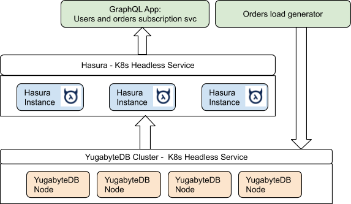

# Scalable, available, multi-region GraphQL apps with Hasura and YugabyteDB

For cloud native API developers, factors like GraphQL Query performance, handling infrastructure outages, and scalability of GraphQL applications are as important as ease of use GraphQL provides.  In this repo we have performed different scaling and relisiency tests for GraphQL applications using YugabyteDB and the observations are captured in the below mentioned docs - 

- [Scaling GraphQL subscriptions to 1 Million subscribers linearly](./1M_subscriptions.md)
- [High availability of GraphQL subscriptions under infrastructure failures](./resilient_graphql_apps.md)
- [Multi-region GraphQL apps](./multi_region_apps.md)

## The Setup

This repo will provide a [benchmark tool](./graphql-subscription-perf-tool) and details for deploying the [benchmark setup](./setup.md) on a Kubernetes cluster. The entire [setup](./setup.md) runs inside Kubernetes. Below are the main components:

- A YugabyteDB cluster running natively inside k8s
- A Hasura k8s service
- The sample application which consists of:
    - A load generator which generates user orders
    - A GraphQL application which subscribes to incoming orders

This is shown diagrammatically below. 



## The Sample Application

The application being modelled is a user order tracking service. Users place orders, which need to be delivered. These orders are tracked and a notification is posted in real-time to kick off the order fulfillment.

## Database Schema

Two tables are used to model this scenario. The [ `user_account`](./resources/user.sql) table has information about the user, while the [`user_orders`](./resources/user_orders.sql) table has the list of orders placed by any user. [`events`](./resources/events.sql) table will be used to verify all the subscriptions recevied by the GraphQL perf tool.

## GraphQL Subscriptions

The dominant query that is performed using subscriptions in Hasura lists the most recent orders placed by a given user. The following GraphQL query is used for this purpose.

```
subscription ($id: bigint!) {
 user_account (where: {userid: {_eq: $id}}) {
   accountname
   givenname
   familyname
   city
   user_orders(order_by: {orderid: desc}) {
     orderid
     ordertotal
     orderdetails
     ordertime
     deliveryStatus
   }
 }
}
```


