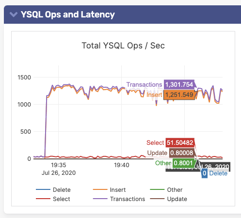
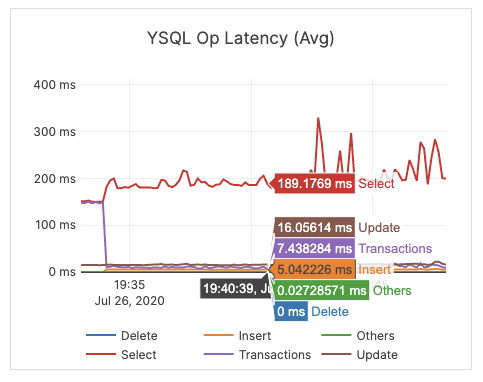
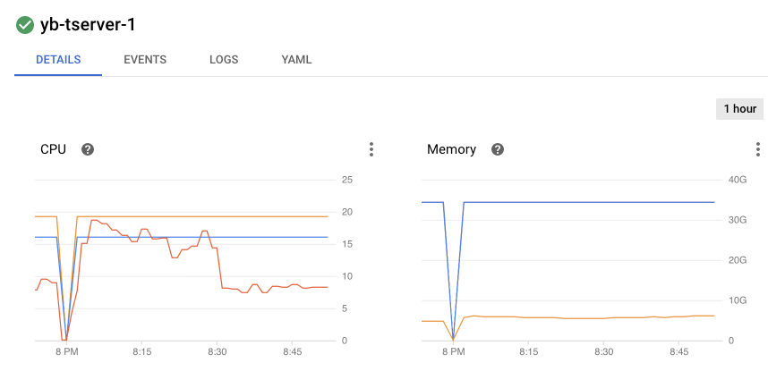
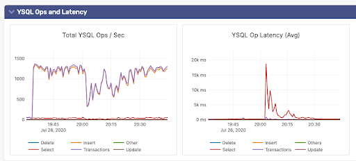

# High availability of subscriptions under failures

This scenario simulates the result of a pod failure while new orders are being placed, and these orders are being consumed by the GraphQL application using subscriptions.

The Hasura service is stateless, and the loss of a pod in the Hasura service can easily be mitigated by rerouting the query to another pod. **The YugabyteDB service is stateful, and hence this section measures the impact of losing a YugabyteDB pod.** 

Note that the YB-TServer service in the YugabyteDB cluster is responsible for serving all application queries, and hence is the pod that is being killed.

## Impact of losing a YugabyteDB pod at 100K subscriptions

The following results were observed as a result of killing a YugabyteDB pod. 
- **GraphQL application-facing impact:** No data loss or failures bubbled up to the application
- **Impact on read transactions:** Reads throughput was minimally affected. The read latency went up from 15ms to about 200ms temporarily. The large latency increase settled in about 2 minutes with no manual intervention. 
- **Impact on write transactions:** The write throughput dropped from 1500 ops/sec to 500 ops/sec when the failure occurred, which healed automatically. The write latencies were not impacted much.

## Detailed Observations

This section outlines the impact of losing a YugabyteDB pod (belonging to the YB-TServer service) while the GraphQL application is running, performing 100K subscriptions.

- Read throughput and latency before killing a pod

- Note that the CPU and memory usage of the YB-TServer service drops as soon as the pod is killed, and recovers once it is resurrected by the Kubernetes scheduler. 

The graph below shows the CPU and memory usage view of the pod that was killed. Notice that the utilization goes to 0 when the pod is killed.

- Read transactions latency gets normalized in 2 mins due to automatic upgrade of follower copies into leaders.

**Note that there was no data loss or read throughput going to zero.**

