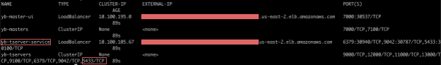

# Steps for Deploying the Benchmark Setup on Kubernetes


## Step 1: Deploy YB cluster on Kubernetes

Follow the [docs](https://docs.yugabyte.com/latest/deploy/kubernetes/) for deploying YugabyteDB Cluster using helm charts on Kubernetes.

YugabyteDB cluster resource deatils: ` 3 pods * 16 vcpu, 32GB RAM, 2 * 100 GB SSD`.

Note the external-IP for yb-tserver-service which we are going to use to establish a connection between YugabyteDB and the serverless application.

```
$ kubectl get services --namespace yb-demo
```


## Step 2: Prepare the database with table schema

a. Open the YSQL shell (ysqlsh), specifying the yugabyte user and prompting for the password.

```
$ ./ysqlsh -U yugabyte -W

When prompted for the password, enter the yugabyte password (default is yugabyte). You should be able to login and see a response like below.

ysqlsh (11.2-YB-2.3.3.0-b0)
Type "help" for help.

yugabyte=#
```

b. Create `hasuratest` database

```
yugabyte=# create database hasuratest;
```
c. Create the tables

```
./bin/ysqlsh -h <yb-tserver-service> -f ./resources/user.sql
./bin/ysqlsh -h <yb-tserver-service> -f ./resources/user_orders.sql
./bin/ysqlsh -h <yb-tserver-service> -f ./resources/events.sql
```

### Step 3: Deploy Hasura

- Lets first Deploy 1 Hasura pod, 4vcpu/ 8GB (20k subscriptions per Hasura instance)

```
kubectl apply -f ./resources/deployment.yaml
kubectl apply -f ./resources/svc.yaml
```
- Track tables and relationships from hasura console
- Update the stateful set to deploy 5 hasura instances (100K subscriptions in total)

### Step 4: Load Primary table, users table

Load 1M users in `user_account` table using `yb-sample-apps` data loader.

```
kubectl run --image=nchandrappa/yb-sample-apps:1.0.12-SNAPSHOT yb-sample-apps-01 --limits="cpu=3200m,memory=4Gi" --requests="cpu=3000m,memory=4Gi" -- --workload SqlProductUserOrdersUpdate --nodes yb-tserver-0.yb-tservers.yb-dev-hasura-perf-cluster.svc.cluster.local:5433 --num_unique_keys 1000000 --num_threads_read 0 --num_threads_write 10 --batch_size 5 --data_load_prefix 0 --action_type loadprimary --default_postgres_database hasuratest --num_writes 1000000
```

### Step 5: Deploy GraphQL subscription perf tool

This simulates 100k subscribers using subscriptions perf tool.

a. [Configure](./graphql-subscription-perf-tool/configmap.yaml) subscriptioin query to be benchmarked with subscribtions perf tool

```
kubectl apply -f configmap.yaml
```

b. Apply following [properites](./graphql-subscription-perf-tool/env.properties) to perf tool. This configures perf tool to connect to YugabyteDB cluster and Hasura GraphQL Engine.

```
kubectl create configmap graphql-perf-properties --from-env-file env.properties
```

c.  Deploy the GraphQL subscrption tool on k8s 

```
kubectl apply -f deployment.yaml
```

### Step 6: Start orders table dataload

Start `orders` table dataload for simulating the new order being placed in the system.

```
kubectl run --image=nchandrappa/yb-sample-apps:1.0.12-SNAPSHOT yb-sample-apps-01 --limits="cpu=4200m,memory=4Gi" --requests="cpu=3800m,memory=4Gi" -- --workload SqlProductUserOrdersUpdate --nodes yb-tserver-0.yb-tservers.yb-dev-hasura-perf-cluster.svc.cluster.local:5433 --num_unique_keys 100000 --num_threads_read 0 --num_threads_write 2 --batch_size 4 --data_load_prefix 0 --action_type loadforeign --default_postgres_database hasuratest --num_writes 1000000
```


